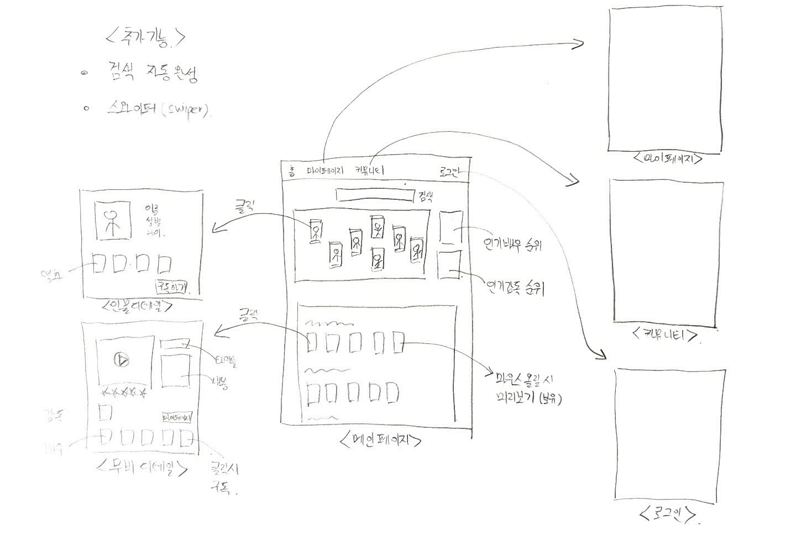

# 최종 프로젝트 :man_artist:

> **프로젝트명 :** 
>
> **팀원 :** 문학일, 이종은
>
> **기간 :** 05.20 ~ 05.27
>
> **내용 :** 저희 팀의 웹사이트는 영화에 초점을 두는게 아닌 영화 속 인물에 초점을 두려고 합니다. 내가 관심있는 감독과 배우들을 구독하고, 그들의 최신 영화부터 과거 영화까지 한눈에 볼 수 있도록 정보를 제공합니다. 또한 최근 유저들에게 가장 인기있는 배우가 누구인지 알려주며 또한 내가 구독한 배우를 다른사람에게 추천하고 의견을 공유할 수 있는 커뮤니티를 제공합니다.

### 초안

### 계획표

|      | 목(5.20) | 금(5.21)      | 토(5.22)      | 일(5.23)             | 월(5.24)                | 화(5.25) | 수(5.26)  | 목(5.27) |
| ---- | -------- | ------------- | ------------- | -------------------- | ----------------------- | -------- | --------- | -------- |
| 학일 | 기획     | 서버개발      | 서버개발      | 주 컴퍼넌트 구현     | 주 컴퍼퍼넌트 구현      | UI 보완  | 영상제작  | PPT 제작 |
| 종은 | 기획     | 스와이퍼 구현 | 스와이퍼 구현 | 디테일 컴퍼넌트 구현 | 메인페이지 상단 UI 구현 | UI 보완  | 영상 제작 | PPT 제작 |

### 개발

> 5.21

협업 중 문제 발생

<style scoped>
@click="[movieId=movie.id, movieIdx=movie.index, movieSubscribe()]"  순서 중요

# 결과물

### 메인화면 

- 메인화면 
  - 첫번째 줄 : 영화 배우, 감독들 출력
  - 두번째 줄 ~ : 인기있는 영화, 장르 별 영화 출력

- 메인화면 - 검색 기능
  - 영어, 한국어 모두 검색 지원 (자동완성 기능으로 이름을 전부 몰라도 가능)

- 배우 디테일 화면

  - 인물의 프로필 정보등을 설명해주고 밑에 출연작품 목록 출력
  - 구독하기 버튼, 영화 포스터를 클릭하면 "마이페이지"에 구독목록에 추가 기능

  

- 영화 디테일 화면
  - 영화의 정보등을 설명해주고 밑에 출연배우의 이름과 배역이름까지 출력
  - 찜하기 버튼, 배우 프로필을 클릭하면 "마이페이지"에 구독목록에 추가 기능
  - 유튜브API를 이용하여 트레일러 출력

- 프로필 화면
  - 오늘 구독한 배우, 영화는 오늘 구독한 목록에 추가되고 하루가 지나면 나의 배우, 나의 영화들로 바뀌는 기능

- 커뮤니티 화면
  - 제목 옆에 댓글이 몇개 달렸는지 보여주는 기능과 조회수 기능 추가
  - 기능적인면에서는 UX를 고려했지만 UI는 개선이 많이 필요함
  - 글을 작성한 시간, 댓글을 작성한 시간등을 추가

